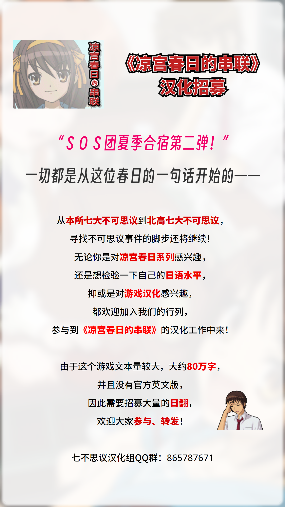

# 《凉宫春日的串联》汉化

本项目是对《凉宫春日的串联》（涼宮ハルヒの直列）的简体中文汉化。

所用的工具基于 [Haroohie Translation Club](https://haroohie.club/)（凉宫春日游戏英文化计划）的 [开源工具](https://github.com/haroohie-club/ChokuretsuTranslationUtility)，[略有修改](https://github.com/Xzonn/ChokuretsuTranslationUtility)。

## 截图预览
  

## 汉化招募中！
