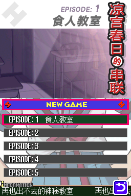
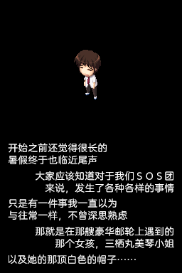

# 《凉宫春日的串联》汉化

## 基本说明
本项目是对《凉宫春日的串联》（涼宮ハルヒの直列）的简体中文本地化。

所用的工具基于 [Haroohie Translation Club](https://haroohie.club/)（凉宫春日游戏英文化计划）的 [开源工具](https://github.com/haroohie-club/ChokuretsuTranslationUtility)，[略有修改](https://github.com/Xzonn/ChokuretsuTranslationUtility)。

## 使用方式
请自行获取游戏日文版 ROM，然后下载 [修正补丁](https://github.com/Xzonn/ACTMChsRevise/releases/latest) 和 [补丁应用工具](https://github.com/Xzonn/NitroPatcher/releases/latest/)，按照工具的说明进行操作。

日文版 ROM 校验码（[No-Intro](https://datomatic.no-intro.org/index.php?page=show_record&s=28&n=3810)）：

- CRC32：8a58f646
- MD5：6536132efddd337aa5069e627591fee5
- SHA-1：81d5c6316dbcef9f4c51984adcaae171124ebb08

## 截图预览
  

## 汉化招募中！

## 授权协议
本项目使用 **[CC BY-NC-SA 4.0](https://creativecommons.org/licenses/by-nc-sa/4.0/legalcode)** 协议授权。若您想基于本项目进行二次创作，请遵守协议内容。这些内容主要包括：

- **署名**：您必须标明本项目的作者（七不思议汉化组），并在您的作品中提供指向本项目的链接。
- **非商业性使用**：您不得将本项目用于商业目的。
- **相同方式共享**：若您基于本项目进行二次创作，您必须以相同的协议授权您的作品。

请阅读本项目的 **[完整授权协议](LICENSE)** 以了解更多信息。
